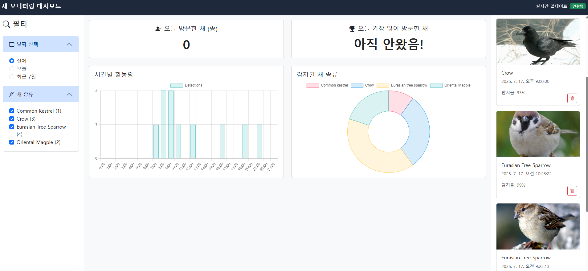
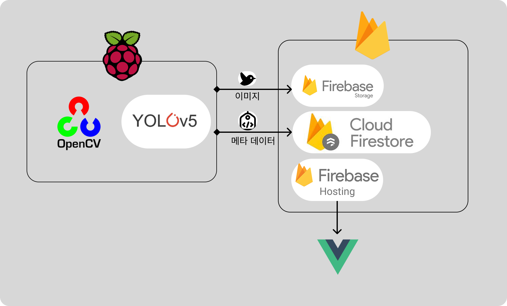
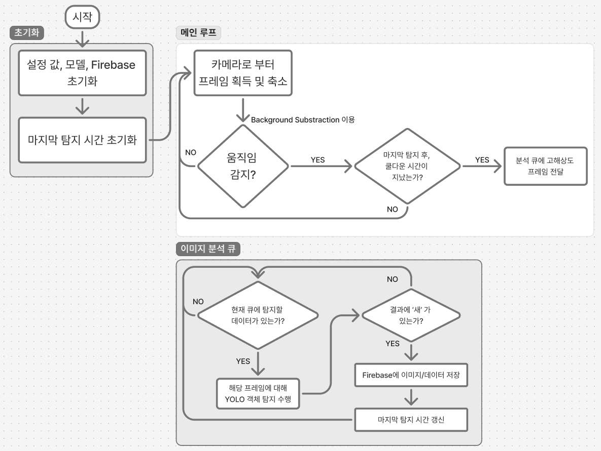

# 🐦 OpenCV, YOLO를 이용한 새 분석 시스템

엣지 컴퓨팅과 Firebase를 결합하여, 실시간 영상 분석부터 데이터 시각화까지의 전체 파이프라인을 구축한 서버리스 프로젝트

집 창문에 새들이 많이 왔다갔다 하는데, 우리집 고양이가 좋아해서 어떤 새들이 가장 많이오나 체크해보기 위해 만들었다

---

## 🛠️ 기술 스택


---

## 📊 대시보드

**[배포된 대시보드](https://bird-recog-project.web.app)**



### 주요 기능

*   **주요 지표:**
    *   **오늘 방문한 새 (종):** 오늘 탐지된 새의 고유 종 수를 표시
    *   **오늘 가장 많이 방문한 새:** 오늘 가장 자주 탐지된 새의 종류를 표시
*   **차트:**
    *   **시간별 활동량:** 시간대별 새 탐지 횟수를 막대 그래프로 시각화
    *   **감지된 새 종류:** 탐지된 새 종류의 분포를 도넛 차트로 시각화
*   **최근 감지 기록:** 가장 최근에 탐지된 새의 이미지와 정보를 표시
*   **실시간 연결 상태:** Firebase와의 연결 상태를 표시
*   **필터링:** 날짜 및 새 종류별로 탐지 데이터를 필터링

---

## 💡 프로젝트 아키텍처



### 구성 요소

*   **1. 엣지 디바이스 (Raspberry Pi 4B):**
    *   **역할:** 실시간 영상 분석 및 데이터 생성, 업로드
    *   **동작:**
        *   OpenCV를 통해 움직임을 감지
        *   움직임이 포착되면 YOLOv5s 모델로 새(bird) 객체를 식별
        *   `firebase-admin` SDK를 사용하여 탐지된 이미지와 메타데이터(새 종류, 시간)를 Firebase에 직접 전송

*   **2. 백엔드 및 데이터베이스 (Firebase):**
    *   **역할:** 데이터 저장, 관리 및 인증
    *   **서비스:**
        *   **Cloud Firestore:** 탐지된 새의 메타데이터(종류, 시간, 이미지 URL 등)를 저장하는 NoSQL 데이터베이스
        *   **Cloud Storage for Firebase:** Pi에서 전송된 원본 이미지를 저장하는 파일 스토리지
    *   **동작:**
        *   Pi에서 보낸 데이터를 수신하여 각각 Firestore와 Storage에 저장
        *   실시간 데이터 동기화 기능을 통해 프론트엔드에 데이터 변경 사항을 즉시 반영

*   **3. 프론트엔드 (Firebase Hosting):**
    *   **역할:** 데이터 시각화 및 사용자 인터페이스
    *   **기술:** Vue.js를 사용하여 개발
    *   **동작:**
        *   Vue.js로 빌드된 정적 웹 파일(HTML, JS, CSS)은 **Firebase Hosting**을 통해 배포
        *   **글로벌 CDN**을 사용하여 빠르고 안정적으로 업로드
        *   사용자 브라우저는 Firebase SDK를 통해 Firestore의 데이터를 실시간으로 구독하여, 새로운 탐지 기록을 자동으로 화면에 업데이트 가능

### 데이터 흐름

1.  **Pi -> Firebase:** `firebase-admin` SDK를 통해 이미지(to Storage)와 메타데이터(to Firestore)를 직접 업로드
2.  **Firebase -> FE:** Firebase SDK를 통해 Firestore의 데이터를 실시간으로 수신하여 화면에 표시

> 별도의 백엔드 서버(EC2, Node.js 등)를 운영할 필요가 없는 **서버리스(Serverless)** 구조를 사용하였음

---

## 🏛️ 아키텍처 설계 결정 (Architectural Decisions)

이 프로젝트는 몇 가지 핵심적인 기술적 판단을 바탕으로 설계하였음

### 1. 왜 하이브리드 방식(움직임 감지 + YOLO)을 선택했는가?

- Raspberry Pi와 같은 엣지 디바이스는 리소스가 제한적이므로, 실시간 영상 전체를 계속해서 YOLO와 같은 고비용 모델로 분석하는 것은 비효율적이고 성능 저하를 유발함
- 먼저 카메라에서 들어오는 프레임을 **저해상도(e.g., 640x480)로 변경**한 뒤, OpenCV의 배경 차감(Background Subtraction)을 이용한 **움직임 감지**로 1차 필터링을 수행
    - 이 방식은 계산 비용이 매우 저렴하여 시스템에 거의 부하를 주지 않음
- 움직임이 포착되었을 때만, **고해상도 원본 프레임**을 캡처하여 YOLO 모델로 '새'가 맞는지 2차 검증을 수행
- 시스템의 평균 CPU 사용률을 크게 낮추고, 불필요한 분석을 줄여 전력 소모를 최소화하며, 정말 의미 있는 데이터만 정확하게 처리하여 전체 시스템의 효율을 극대화


### 2. 왜 서버리스(Firebase) 아키텍처를 선택했는가?

- 전통적인 방식처럼 데이터를 처리하고 API를 제공하기 위해 별도의 백엔드 서버(예: AWS EC2, GCP VM)를 구축하고 24시간 운영하는 것은 상당한 관리 비용과 노력이 필요
- **Firebase**가 제공하는 서버리스 환경을 활용. 
    - Raspberry Pi는 `firebase-admin` SDK를 통해 인증 후 직접 Firestore(DB)와 Storage에 데이터를 전송합
    - 프론트엔드(Vue.js) 역시 Firebase SDK를 통해 데이터를 실시간으로 구독
- 백엔드 서버 코드 개발 및 인프라 관리에 드는 시간을 없애고, 핵심 기능인 '새 탐지 로직'과 '데이터 시각화' 개발에만 집중

### 3. 왜 커스텀 학습된 YOLOv5s 모델을 사용하는가?

- 일반적인 객체 탐지 모델은 '새'라는 포괄적인 클래스는 탐지할 수 있지만, 우리 주변에서 흔히 볼 수 있는 '까마귀', '참새', '직박구리' 등 특정 새의 종류를 구분하지는 못함
- 또한, Raspberry Pi와 같은 엣지 디바이스에서는 모델의 크기와 추론 속도가 매우 중요
- **YOLOv5s (small)** 아키텍처를 기반으로, 직접 수집하고 레이블링한 **커스텀 데이터셋**을 사용하여 모델을 재학습(fine-tuning)함 
    - YOLOv5s는 빠른 추론 속도와 작은 모델 크기로 엣지 디바이스에 적합하며, 커스텀 학습을 통해 특정 새 종류에 대한 탐지 정확도를 높혔음
- Raspberry Pi 환경에서도 실시간에 가까운 탐지 속도를 유지하면서, 단순히 '새'를 넘어 **어떤 종류의 새가 방문했는지**를 식별하고 기록할 수 있게 함 

---

## ⚙️ 전체 동작 흐름



위 다이어그램은 다음의 구체적인 순서로 동작하여 데이터의 정확성과 시스템 효율을 높입니다.

1.  **(입력)** 카메라로부터 실시간 영상 프레임을 입력받음
2.  **(1차 필터링)** **저해상도**로 변환된 프레임에서 **움직임**을 감지, 움직임이 없으면 1번으로 돌아가서 대기
3.  **(2차 필터링)** 움직임이 감지되면, **고해상도 원본** 프레임으로 **YOLO 분석**을 수행하여 '새' 객체가 있는지 확인
4.  **(결과 확인)** 만약 '새'가 아니라면(YOLO 결과 필터링), 해당 프레임은 무시하고 1번으로 돌아감
5.  **(데이터 생성)** '새'가 맞다면, 탐지 결과(이미지, 새 종류, 시간)를 Firebase에 업로드
6.  **(중복 방지)** **시간 기반 쿨다운(Cooldown)**을 적용. 즉, 마지막 탐지 이후 일정 시간(예: 30초)이 지나지 않았다면 중복으로 간주하고 1번으로 돌아감
7.  **(업로드)** 쿨다운을 통과하면, 준비된 데이터를 Firebase에 업로드하고 다시 1번부터 과정을 반복

---

## ⚙️ 설치 및 실행 가이드

**1. 소스 코드 복제**
```bash
git clone https://github.com/your-username/your-repo-name.git
cd your-repo-name
```

**2. 의존성 설치**
Python `3.8` 이상 버전이 필요
```bash
pip install -r requirements.txt
```

**3. Firebase 설정**
이 프로젝트는 Raspberry Pi에서 Firebase에 직접 데이터를 전송하기 위해 **Firebase Admin SDK**를 사용함

*   Firebase 프로젝트를 생성하고, **Firestore Database**와 **Storage**를 활성화
*   프로젝트 설정 > **서비스 계정**으로 이동하여 **새 비공개 키를 생성**하고 `.json` 파일을 다운로드
*   **보안 주의:** 다운로드한 키 파일은 **절대 Git에 커밋하면 안됨!!!!!!** (`.gitignore`에 `*.json` 추가 필수)

**4. 서비스 계정 키 설정 (중요)**
다운로드한 `.json` 키 파일의 경로를 **환경 변수**로 설정해야함

이는 소스 코드에 민감한 정보를 직접 하드코딩하는 것을 방지하기 위함

**Linux / macOS:**
```bash
export GOOGLE_APPLICATION_CREDENTIALS="/path/to/your/serviceAccountKey.json"
```

**Windows:**
```powershell
$env:GOOGLE_APPLICATION_CREDENTIALS="C:\path\to\your\serviceAccountKey.json"
```

> 또는, `src/firebase_manager.py` 파일에서 `cred = credentials.Certificate(os.getenv('GOOGLE_APPLICATION_CREDENTIALS'))` 라인을 `cred = credentials.Certificate("your/key/path.json")` 과 같이 직접 수정할 수도 있으나, 보안상 권장되지 않음

**5. 프로그램 실행**
```bash
python src/main.py
```

---

## 📈 향후 고도화 방안

*   **1. 객체 트래킹 (Object Tracking) 도입:** 개체에 고유 ID를 부여하여 한 마리의 새를 한 번만 카운트하도록 정확도를 향상시켜보기
*   **2. 카메라 세팅 로직 고도화:** 카메라의 밝기 등을 수동으로 조절해야하는 문제점 발생. 또한 움직임의 크기를 분석하여 벌레, 노이즈 등 불필요한 YOLO 분석을 줄여 효율성을 극대화
*   **3. 다양한 새 종류 모델 학습:** 커스텀 데이터셋으로 YOLO 모델을 재학습시켜 까마귀, 참새 등 특정 새의 종류를 구분하는 기능을 추가
*   **4. 다른 AI와 접목시켜 정확도 향상:** 이미지보다, birdNet과 같이 소리를 이용해 새 종을 판단하는것도 괜찮을 것 같음. 이를 접목시켜 이미지 + 소리를 이용하여 정확도를 향상시킬 수 있을듯 

---

